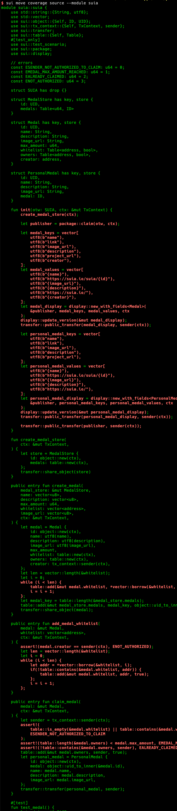

# Sui Move Test

Unit tests are highly recommended for every smart contract.
At least basic tests should be written to ensure the core logic functions as expected.
Additionally, coverage tests are also recommended to ensure all code paths are tested.

Sui Binary offers a `move test` command to run unit tests, along with some extra flags to support coverage testing
and generate a gas report.

For writing basic tests, we recommend refer the [official doc](https://docs.sui.io/build/move/build-test#sui-specific-testing).

The documentation below will focus on the extra flags and features provided by Sui Binary.

```
$ sui move test -h
sui-move-test
Run Move unit tests in this package

USAGE:
    sui move test [OPTIONS] [filter]

ARGS:
    <filter>    An optional filter string to determine which unit tests to run. A unit test will
                be run only if it contains this string in its fully qualified
                (<addr>::<module_name>::<fn_name>) name

OPTIONS:
        --coverage
            Collect coverage information for later use with the various `move coverage` subcommands

    -s, --statistics [<report_statistics>]
            Report test statistics at the end of testing. CSV report generated if 'csv' passed
```

```
$ sui move test --coverage -s
INCLUDING DEPENDENCY Sui
INCLUDING DEPENDENCY MoveStdlib
BUILDING Suia
INCLUDING DEPENDENCY Sui
INCLUDING DEPENDENCY MoveStdlib
BUILDING Suia
Running Move unit tests
[ PASS    ] 0x0::showcase::test_showcase
[ PASS    ] 0x0::suia::test_medal

Test Statistics:

┌──────────────────────────────┬────────────┬───────────────────────────┐
│          Test Name           │    Time    │         Gas Used          │
├──────────────────────────────┼────────────┼───────────────────────────┤
│ 0x0::showcase::test_showcase │   0.168    │           1046            │
├──────────────────────────────┼────────────┼───────────────────────────┤
│ 0x0::suia::test_medal        │   0.168    │            412            │
└──────────────────────────────┴────────────┴───────────────────────────┘

Test result: OK. Total tests: 2; passed: 2; failed: 0

$ sui move coverage summary
+-------------------------+
| Move Coverage Summary   |
+-------------------------+
Module 0000000000000000000000000000000000000000000000000000000000000000::showcase
>>> % Module coverage: 60.71
Module 0000000000000000000000000000000000000000000000000000000000000000::suia
>>> % Module coverage: 38.95
Module 0000000000000000000000000000000000000000000000000000000000000000::test_nft
>>> % Module coverage: 0.00
+-------------------------+
| % Move Coverage: 41.89  |
+-------------------------+

$ sui move coverage source --module suia
```


